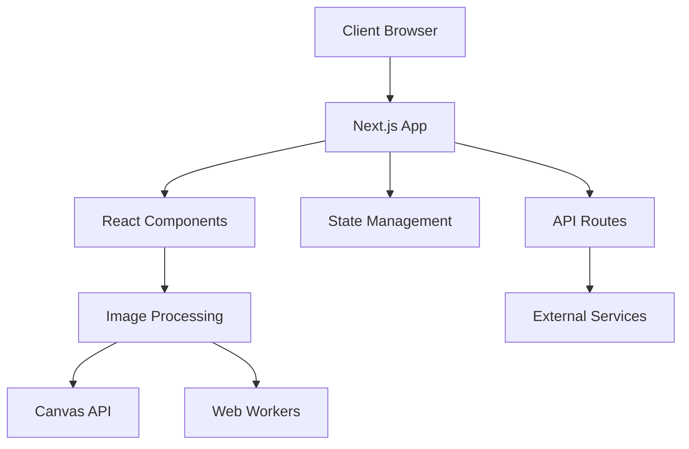
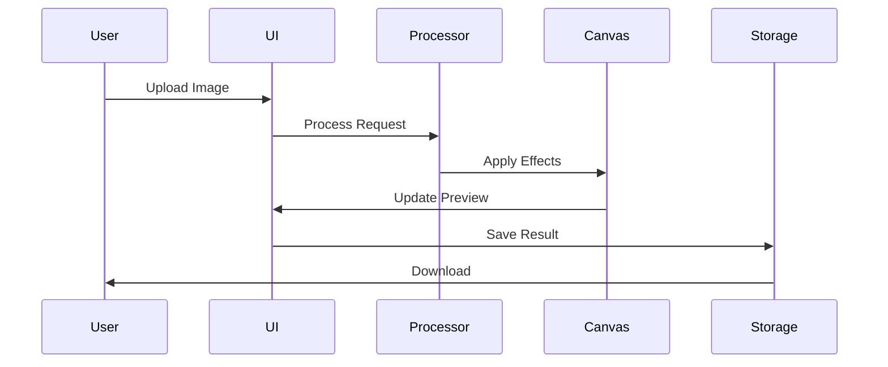
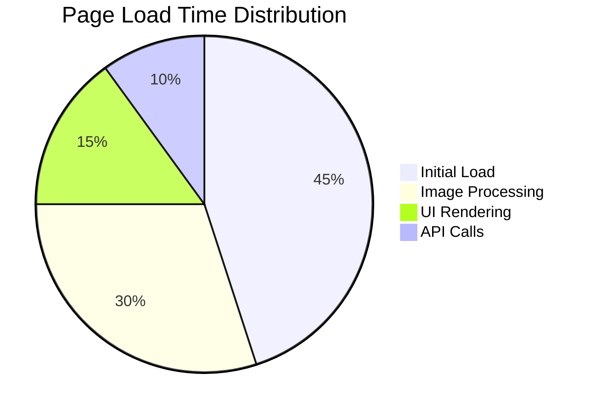
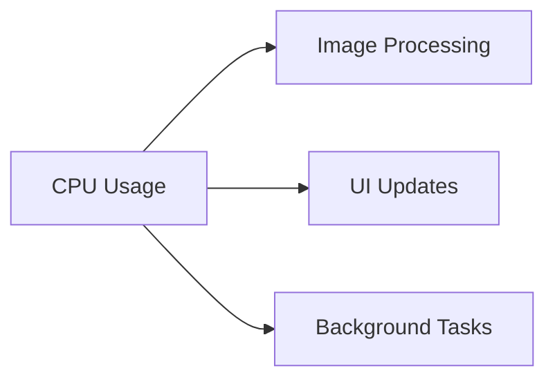

# Image to Sketch Converter

<div align="center">


[](LICENSE)
[](http://makeapullrequest.com)

</div>

## 📝 Table of Contents
- [Overview](#overview)
- [Features](#features)
- [Architecture](#architecture)
- [Tech Stack](#tech-stack)
- [Getting Started](#getting-started)
- [Project Structure](#project-structure)
- [Components](#components)
- [API Documentation](#api-documentation)
- [Performance Metrics](#performance-metrics)
- [Development](#development)
- [Contributing](#contributing)
- [License](#license)

## 🎯 Overview
Image to Sketch Converter is a modern web application that transforms regular images into artistic sketches. Built with Next.js and React, it provides a seamless user experience for image conversion with real-time preview and customization options.

### Key Benefits
- 🎨 Transform photos into artistic sketches instantly
- 🚀 Real-time processing with immediate feedback
- 🎯 Precise control over conversion parameters
- 📱 Cross-platform compatibility
- 🔒 Privacy-focused (all processing done client-side)

## ✨ Features

### Core Features
- 🖼️ **Image to Sketch Conversion**
  - Multiple sketch styles
  - Adjustable intensity levels
  - Real-time preview
  - Batch processing support

- 🔄 **Image Comparison**
  - Side-by-side view
  - Slider comparison
  - Before/After toggle
  - Zoom and pan capabilities

- 🎨 **Customization Options**
  - Edge detection sensitivity
  - Contrast adjustment
  - Noise reduction
  - Color preservation options

### User Experience
- 📱 **Responsive Design**
  - Mobile-first approach
  - Touch-friendly interface
  - Adaptive layouts
  - Cross-browser compatibility

- 🌓 **Theme Support**
  - Dark/Light mode
  - Custom theme options
  - System preference detection
  - Smooth transitions

- 🔍 **Advanced Tools**
  - Area selection
  - Selective conversion
  - Multiple export formats
  - Batch processing

## 🏗️ Architecture

### System Architecture


### Data Flow


## 🛠️ Tech Stack

### Frontend
- **Framework**: Next.js 15.2.4
  - Server-side rendering
  - Static site generation
  - API routes
  - Image optimization

- **Language**: TypeScript 5
  - Type safety
  - Enhanced IDE support
  - Better maintainability

- **UI Library**: React 19
  - Component-based architecture
  - Virtual DOM
  - Hooks system

### Styling & UI
- **CSS Framework**: Tailwind CSS 3.4.17
  - Utility-first approach
  - Custom configuration
  - Responsive design

- **UI Components**: Radix UI
  - Accessible components
  - Unstyled design
  - Custom theming

### Development Tools
- **Package Manager**: pnpm
- **Build Tool**: Next.js
- **Linting**: ESLint
- **Formatting**: Prettier
- **Testing**: Jest

## 🚀 Getting Started

### Prerequisites
- Node.js (Latest LTS version)
- pnpm (Package manager)
- Git

### Environment Setup
1. Clone the repository:
```bash
git clone https://github.com/yourusername/imagetosketch.git
cd imagetosketch
```

2. Install dependencies:
```bash
pnpm install
```

3. Configure environment variables:
```bash
cp .env.example .env.local
```

4. Run the development server:
```bash
pnpm dev
```

5. Open [http://localhost:3000](http://localhost:3000) in your browser.

## 📁 Project Structure
```
├── app/                    # Next.js app directory
│   ├── about/             # About page
│   ├── convert/           # Conversion page
│   ├── gallery/           # Gallery page
│   ├── layout.tsx         # Root layout
│   └── page.tsx           # Home page
├── components/            # React components
│   ├── ui/               # UI components
│   │   ├── button.tsx    # Button component
│   │   ├── input.tsx     # Input component
│   │   └── ...
│   ├── area-selector.tsx # Area selection component
│   ├── image-uploader.tsx# Image upload component
│   └── ...
├── public/               # Static assets
│   ├── images/          # Image assets
│   └── fonts/           # Font files
├── styles/              # Global styles
│   ├── globals.css      # Global CSS
│   └── themes/          # Theme configurations
├── lib/                 # Utility functions
│   ├── utils.ts         # Helper functions
│   └── constants.ts     # Constants
└── hooks/              # Custom React hooks
    ├── useImage.ts     # Image processing hook
    └── useTheme.ts     # Theme management hook
```

## 🧩 Components

### Core Components
- **Area Selector** (`area-selector.tsx`)
  - Interactive selection tool
  - Multiple selection modes
  - Real-time preview
  - Coordinate tracking

- **Image Comparison** (`image-comparison.tsx`)
  - Slider comparison
  - Zoom functionality
  - Touch support
  - Performance optimized

- **Image Uploader** (`image-uploader.tsx`)
  - Drag-and-drop support
  - File validation
  - Progress tracking
  - Error handling

### UI Components
- **Progress Indicator**
  - Animated progress bar
  - Status messages
  - Error states
  - Success feedback

- **Theme Provider**
  - Theme switching
  - Persistence
  - System preference
  - Custom themes

## 📚 API Documentation

### Image Processing API
```typescript
interface ImageProcessor {
  convertToSketch(image: File, options: SketchOptions): Promise<Blob>;
  adjustParameters(params: ProcessingParams): void;
  getPreview(): Promise<string>;
}
```

### Component Props
```typescript
interface ImageUploaderProps {
  onUpload: (file: File) => void;
  maxSize: number;
  allowedTypes: string[];
  multiple?: boolean;
}
```

## 📊 Performance Metrics

### Load Time Distribution


### Resource Usage


## 💻 Development

### Available Scripts
```bash
# Run development server
pnpm dev

# Build for production
pnpm build

# Start production server
pnpm start

# Run linting
pnpm lint

# Run tests
pnpm test

# Generate documentation
pnpm docs
```

### Code Quality
- ESLint configuration
- Prettier formatting
- TypeScript strict mode
- Unit test coverage

## 🤝 Contributing
Contributions are welcome! Please feel free to submit a Pull Request.

### Development Workflow
1. Fork the repository
2. Create your feature branch (`git checkout -b feature/AmazingFeature`)
3. Commit your changes (`git commit -m 'Add some AmazingFeature'`)
4. Push to the branch (`git push origin feature/AmazingFeature`)
5. Open a Pull Request

### Code Style
- Follow TypeScript best practices
- Use functional components
- Implement proper error handling
- Add appropriate documentation

## 📄 License
This project is licensed under the MIT License - see the [LICENSE](LICENSE) file for details.

---

<div align="center">
Made with ❤️ by [Your Name]

[](https://github.com/yourusername/imagetosketch/stargazers)
[](https://github.com/yourusername/imagetosketch/network/members)
[](https://github.com/yourusername/imagetosketch/issues)
</div> 