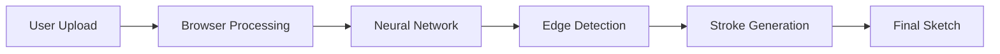

# 🎨 Hand-Drawn Sketch Generator

[](https://github.com/Kedhareswer/MLGeneFunction/blob/main/LICENSE)
[](https://github.com/Kedhareswer/MLGeneFunction/stargazers)
[](https://github.com/Kedhareswer/MLGeneFunction/network/members)
[](https://github.com/Kedhareswer/MLGeneFunction/issues)
[](https://nextjs.org/)
[](https://www.tensorflow.org/)
[](https://vercel.com/)

Transform your digital images into authentic hand-drawn sketches using our sophisticated deep learning model. Perfect for artists, designers, and creative enthusiasts.

## 🌟 Features

- 🖼️ **High-Quality Transformation** - Convert photos into realistic hand-drawn sketches
- 🎯 **Multiple Styles** - Support for various artistic styles including pencil and charcoal
- 🔒 **Privacy-First** - All processing happens in your browser
- 📱 **Responsive Design** - Works on both desktop and mobile devices
- 💾 **High-Resolution Downloads** - Get your sketches in high quality
- 🔄 **Easy Sharing** - Direct social media integration

## 🚀 Technology Stack

### Core Technologies
- Next.js for frontend
- Deep Learning model trained on CUHK Face Sketch Database (CUFS)
- Client-side processing for privacy
- Vercel Analytics integration

### Key Components
- Neural Networks for image processing
- Edge Detection algorithms
- Stroke Simulation techniques

## 📊 Architecture



## 🛠️ Getting Started

### Prerequisites
- Node.js 14.x or higher
- npm or yarn
- Modern web browser

### Installation

1. Clone the repository:
```bash
git clone https://github.com/Kedhareswer/MLGeneFunction.git
```

2. Install dependencies:
```bash
cd MLGeneFunction
npm install
```

3. Run the development server:
```bash
npm run dev
```

## 💡 Usage

1. **Upload Image**: Click the upload button or drag and drop your image
2. **Select Style**: Choose your preferred sketch style
3. **Customize**: Adjust parameters if needed
4. **Download**: Get your transformed image in high resolution

## 🔬 Technical Details

### Processing Pipeline
1. Image preprocessing
2. Neural network transformation
3. Edge detection and enhancement
4. Stroke simulation
5. Post-processing and refinement

### Privacy Features
- Client-side processing
- No server storage of images
- Secure data handling

## 🔮 Future Enhancements

- [ ] Expanding dataset for improved sketch accuracy
- [ ] Supporting different artistic styles beyond sketches
- [ ] Introducing colorized hand-drawn effects
- [ ] Batch processing capabilities
- [ ] Advanced customization options

## 🤝 Contributing

Contributions are welcome! Please feel free to submit a Pull Request. For major changes, please open an issue first to discuss what you would like to change.

## 📄 License

Copyright (c) 2025 Kedhareswer

This repository is made publicly visible for informational and research purposes only. You are NOT permitted to download, clone, pull, or use any content from this repository without prior, explicit, written permission from the repository owner.

Licensed under the Apache License, Version 2.0 - see the [LICENSE](LICENSE) file for details.

## 📞 Contact

For access requests or inquiries, please contact the repository owner via GitHub.

## 🌟 Acknowledgments

- CUHK Face Sketch Database (CUFS) for training data
- The open-source community for various tools and libraries
- Contributors and testers who helped improve the project
